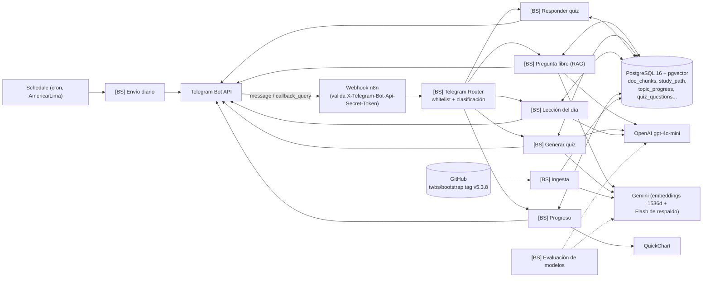

# Bootstrap Study Bot

Bot de Telegram para estudiar la documentación oficial de Bootstrap 5.3 con RAG: ruta guiada, lección diaria, quizzes adaptativos, repaso espaciado y preguntas libres citando la sección oficial.

**English summary:** A Telegram bot that teaches the official Bootstrap 5.3 docs through retrieval-augmented generation — a guided study path, daily lessons, adaptive quizzes, spaced repetition and free-form Q&A with citations. Built on self-hosted n8n (Docker), PostgreSQL 16 + pgvector, the Telegram Bot API, OpenAI (`gpt-4o-mini`) and Gemini (`gemini-embedding-2` for embeddings, free-tier Flash models as chat fallback). Workflows are generated from versioned JS/SQL/prompt source, not hand-edited in the n8n UI. Key measured results: retrieval threshold calibrated on real similarity data (0.68), semantic quiz dedup calibrated on 70 real pairs (cosine 0.935), and a model evaluation (20 questions, LLM judge) that picked `gpt-4o-mini` over `gpt-5.4-mini` for ~5x lower cost (~US$0.0005/question).

## Qué hace

- `/start` — bienvenida y explicación.
- `/hoy` — lección del tema que toca en la ruta (resumen + ejemplo + enlace oficial) con botón "Ponerme a prueba" (test de 3 preguntas, se aprueba con 2).
- `/quiz [tema]` — pregunta de opción múltiple o de completar el espacio, con botones inline y botón "Otra pregunta".
- `/pregunta <duda>` o un mensaje de texto libre — consulta al RAG, responde en español citando la URL oficial.
- `/progreso` — imagen (QuickChart) con el avance por sección y los 3 temas más débiles.
- `/saltar` — da un tema por visto sin el test ("Ya lo sé").
- `/hora` — configura a qué horas llegan los envíos diarios (America/Lima).
- Envío diario automático (10:00 y 20:00 por defecto): lección o repaso según corresponda.

<!-- captura: docs/demo.png -->

## Arquitectura

Telegram solo permite un webhook por bot, así que todo entra por un único router que aplica una whitelist de `chat_id` y deriva a sub-workflows independientes con *Execute Workflow*.



| Workflow | Qué hace |
|---|---|
| `[BS] Telegram Router` | Único webhook; whitelist de `chat_id`; clasifica el update y ejecuta el sub-workflow correcto. |
| `[BS] Setup DB` | Aplica `sql/*.sql` contra `bootstrap_bot` (idempotente). |
| `[BS] Ingesta` | Descarga la doc de `twbs/bootstrap` (tag 5.3.x), la fragmenta, embebe y guarda en `doc_chunks` / `study_path`. |
| `[BS] Pregunta libre (RAG)` | Recupera top-6 fragmentos, reescribe la pregunta con historial, responde citando URL, guarda en `rag_queries`. |
| `[BS] Generar quiz` | El código elige tema/formato/dificultad; el LLM redacta; valida formato, dedup semántico y guarda. |
| `[BS] Responder quiz` | Llama a `submit_answer` (atómico) y edita el mensaje con el resultado. |
| `[BS] Lección del día` | Genera o reutiliza la lección cacheada del tema actual; ofrece el test. |
| `[BS] Progreso` | Arma el gráfico de QuickChart y los temas más débiles. |
| `[BS] Envío diario` | Disparado por Schedule; decide lección vs. repaso por `chat_id` y hora configurada. |
| `[BS] Evaluación de modelos` | Reusa la recuperación del RAG para comparar modelos de chat con el mismo contexto. |
| `[BS] Test RAG` / arneses | Webhooks protegidos por secreto para probar RAG/quiz/estudio sin pasar por Telegram (`eval/`). |

## Decisiones de diseño

- **Workflows generados desde código, no editados a mano en n8n.** `scripts/build-*.js` arman el JSON del workflow a partir de `scripts/*-lib.js` (la lógica, con sus propios tests locales en `scripts/test-*.js`), `sql/` y `prompts/`. El repo es la fuente de verdad; n8n solo ejecuta lo que el repo generó.
- **Ingesta desde el repo oficial:** 108 archivos MDX del tag `v5.3.8` (`site/src/content/docs`, vía la API de GitHub) → limpieza del front matter y de los componentes de ejemplo → fragmentos por `##`/`###` con tope de tamaño y solapamiento → **986 fragmentos** y una ruta de **91 temas**. Cada fragmento lleva su URL oficial con `#ancla` y un `content_hash`, así que reindexar solo embebe lo que cambió.
- **Embeddings asimétricos con Gemini (`gemini-embedding-2`, 1536 dimensiones, free tier).** Documentos como `title: … | text: …`, consultas como `task: search result | query: …`. Decisión de costo (gratis) tomada en la Fase 2, antes con OpenAI `text-embedding-3-small`.
- **Umbral de similitud del RAG calibrado con datos, no a ojo:** 0.68, elegido entre el mínimo observado dentro de la documentación y el máximo fuera de ella (ver `UMBRAL` en `scripts/build-pregunta.js` y los datos en `eval/fase3-umbral.json`). Por debajo, el bot responde "no está en la documentación de 5.3" sin llamar al LLM.
- **"El código decide, el modelo redacta."** El workflow elige el tema, el formato (1 de cada 3 preguntas de completar el espacio) y la dificultad; el LLM solo redacta, con salida JSON validada por código y un reintento si no cumple el formato.
- **`submit_answer` atómico con `FOR UPDATE`** (`sql/001_schema.sql`, `sql/004_fase5.sql`): bloquea la fila de la pregunta, valida dueño y que no esté respondida, así un doble toque en un botón de Telegram no cuenta dos veces. Mismo patrón con `pg_advisory_xact_lock` para el test de la lección y una tabla `quiz_next_clicks` con `ON CONFLICT DO NOTHING` para el botón "Otra pregunta".
- **Deduplicación semántica de preguntas de quiz**, no por texto exacto: embedding de pregunta+respuesta, umbral de coseno 0.935 calibrado con 70 pares reales (`eval/fase5-dedup.json`), comparado contra las últimas 20 preguntas del mismo tema en 24 h.
- **Repetición espaciada y dificultad adaptativa** en `topic_progress`: acierto duplica el intervalo (tope 60 días), fallo lo baja a 1 día; 3 aciertos seguidos suben de nivel, 2 fallos seguidos bajan.

## Evaluación de modelos (Fase 6)

20 preguntas (12 normales, 4 trampas de Bootstrap 4, 4 fuera de la doc) corridas contra cada modelo con los mismos fragmentos recuperados y el mismo prompt, juzgadas con un LLM juez (`prompts/juez.md`) y revisión de los casos marcados.

| Modelo | Nota (0-5) | Fallos de API | US$/pregunta |
|---|---|---|---|
| `gpt-4o-mini` | 4.85 | 0/20 | 0.00048 |
| `gpt-5.4-mini` | 4.60 | 0/20 | 0.00257 |
| `gemini-3.5-flash` | 3.35 | 6/20 | 0.0072 |
| `gemini-3.7-flash` | 1.85 | 12/20 | 0.0029 |

**Decisión (2026-10-07):** `gpt-4o-mini` como modelo principal (RAG, quiz, lección), ~5× más barato que `gpt-5.4-mini`, con los dos modelos Gemini free tier como respaldo gratuito si OpenAI falla. El juez es indulgente (caso de la trampa `jumbotron`, nota 5 cuando debería rondar 2) y es el mismo modelo que generó una de las respuestas evaluadas, así que la nota de trampas v4 de `gpt-4o-mini` está inflada; si el bot escalara a producción, `gpt-5.4-mini` sería la elección más segura. Detalle completo, limitaciones y cómo reproducir el eval en [`eval/fase6-conclusion.md`](eval/fase6-conclusion.md).

## Seguridad

- Whitelist de `chat_id` aplicada antes de cualquier rama del router; al resto se lo ignora.
- Webhook de n8n validado con el header `X-Telegram-Bot-Api-Secret-Token` (desviación consciente de usar el nodo Telegram Trigger, para no tocar la configuración del servidor n8n compartido con otros bots).
- Arneses de prueba (`[BS] Test RAG` y similares) protegidos por un secreto propio en el header, distinto del secreto del webhook de Telegram.
- Secretos solo como credenciales nombradas en n8n; nunca en el repo (`.env.example` sin valores).
- Contenedor de PostgreSQL en la misma red Docker que n8n, sin puertos publicados; usuario de base de datos propio para el bot.
- Salida a Telegram en HTML escapado.
- **Hallazgo de auditoría e inyección SQL corregida:** un nodo pasaba los parámetros como JSON dentro de dollar-quoting (`$bsjson$…$bsjson$`) directamente en el texto del SQL. `JSON.stringify` no escapa el carácter `$`, así que un texto de usuario con esa etiqueta podía cerrar el literal antes de lo esperado y alterar la consulta. Corrección: SQL estático con marcadores `$1`, `$2`… y los valores reales pasados como *bind parameters* (`options.queryReplacement`), nunca interpolados en el texto. Se centralizó en un único helper (`scripts/sql-node.js`) y se agregó `scripts/test-sql-params.js`, que falla si el patrón de dollar-quoting con JSON vuelve a aparecer.

## Modelo de datos

Ver [`sql/001_schema.sql`](sql/001_schema.sql) y [`sql/004_fase5.sql`](sql/004_fase5.sql) (idempotentes, se aplican en orden).

| Tabla / función | Para qué |
|---|---|
| `study_path` | Ruta de estudio en el orden oficial de la doc (`topic_key = section/page`). |
| `doc_chunks` | Fragmentos de la doc con su embedding, URL con ancla, `content_hash` y metadata para el nodo PGVector de n8n. |
| `topic_progress` | Progreso por `(chat_id, topic_key)`: aciertos, racha, nivel, intervalo de repaso, estado. |
| `quiz_questions` | Cada pregunta generada (tema, formato, opciones, embedding para dedup, tokens, respuesta). |
| `rag_queries` | Registro de preguntas libres: costo, latencia, fragmentos usados, si hubo reintento por sintaxis v4. |
| `lessons` | Caché de la lección por tema (se genera una vez, se reutiliza). |
| `lesson_tests` | Intentos del test de la lección (3 preguntas, aprueba con 2). |
| `bot_settings` / `schedule_runs` | Horas configuradas por chat y qué envíos diarios ya se hicieron. |
| `quiz_next_clicks` | Reclama el botón "Otra pregunta" una sola vez por mensaje. |
| `submit_answer(...)` | Función atómica (`FOR UPDATE`) que corrige, actualiza progreso/repaso/dificultad y, si aplica, cierra el test de la lección. |
| `current_topic(...)` / `start_lesson_test(...)` | Helpers: tema actual de la ruta; arranque del test con candado por chat. |

## Estructura del repo

```
bootstrap-study-bot/
  CLAUDE.md            # spec de trabajo usada con el asistente
  .mcp.json            # config de n8n-mcp (API key por variable de entorno)
  .env.example
  sql/                 # esquema versionado (001-004) + SQL por workflow
  prompts/             # system prompts versionados (rag, quiz, leccion, juez)
  scripts/             # build-*.js generan los workflows; *-lib.js es la lógica con tests
  eval/                # preguntas, resultados y conclusión de la Fase 6
  workflows/           # exports limpios de n8n (sin IDs de credenciales ni datos personales)
  ops/                 # despliegue reproducible (ids locales ignorados por git)
  README.md
```

## Cómo reproducirlo

1. n8n self-hosted en Docker (en este caso, un VPS propio en Contabo), expuesto por HTTPS (`WEBHOOK_URL`).
2. Levantar un contenedor `pgvector/pgvector:pg16` en la misma red Docker que n8n, sin publicar puertos.
3. Crear la base `bootstrap_bot` y un usuario propio para el bot.
4. Correr `[BS] Setup DB` (o aplicar `sql/*.sql` en orden) para crear el esquema.
5. Crear en la interfaz de n8n las credenciales por nombre: Postgres, OpenAI, Gemini, Telegram Bot API y el secreto de prueba — nunca en el repo.
6. Desplegar los workflows: importar los JSON de `workflows/` en n8n, o generarlos y subirlos desde el código con `bash ops/deploy.sh build|publicar` (ver [`ops/README.md`](ops/README.md) y [`workflows/README.md`](workflows/README.md) para el detalle y los IDs locales).
7. Correr `[BS] Ingesta` para descargar, fragmentar, embeber e indexar la documentación de Bootstrap 5.3.
8. Configurar el webhook del bot con `setWebhook` apuntando a la URL del router y el `secret_token` del header.
9. Añadir el propio `chat_id` a la whitelist del router.
10. Probar `/start`, `/hoy`, `/quiz` y una pregunta libre en Telegram.

## Costos

- Embeddings: gratis (free tier de Gemini, `gemini-embedding-2`).
- Pregunta libre (RAG) con `gpt-4o-mini`: ≈ US$0.0005 por pregunta.
- Lección: se paga una sola vez por tema (se cachea en `lessons` y se reutiliza para todos los niveles).

## Limitaciones y próximos pasos

- Fallos de recuperación puntuales (p. ej. `flex`/`justify-content`) donde la similitud no alcanza el umbral aunque el contenido exista en la doc.
- Calidad de `gpt-4o-mini` observada en la prueba de humo: en una pregunta de color primario sugiere redefinir `$theme-colors` solo con `primary` (borra los demás colores del mapa) en vez de cambiar `$primary` o usar `map-merge`; en un quiz de `flex` generó dos opciones igualmente válidas.
- El free tier de Gemini devuelve 503/429 con cierta frecuencia; es respaldo, no la ruta principal del chat.
- Ideas pendientes: búsqueda híbrida full-text + vector, HyDE para mejorar recuperación, ampliar `eval/preguntas.json` más allá de 20 preguntas y sumar un segundo juez independiente.

## Cómo se construyó

Este proyecto se construyó con [Claude Code](https://claude.com/claude-code) como asistente de pair-programming, guiado fase por fase por el propietario del proyecto (Giancarlos). Las decisiones de diseño y de costo se tomaron con datos medidos: embeddings de Gemini por costo cero, un juez barato para la evaluación de modelos, `gpt-4o-mini` sobre `gpt-5.4-mini` por precio, y usar un Webhook con secreto en vez de tocar la configuración del servidor n8n compartido con otros bots. Cada fase se probó en Telegram y en n8n antes de avanzar a la siguiente. [`CLAUDE.md`](CLAUDE.md) es la especificación de trabajo usada con el asistente durante todo el proyecto.
